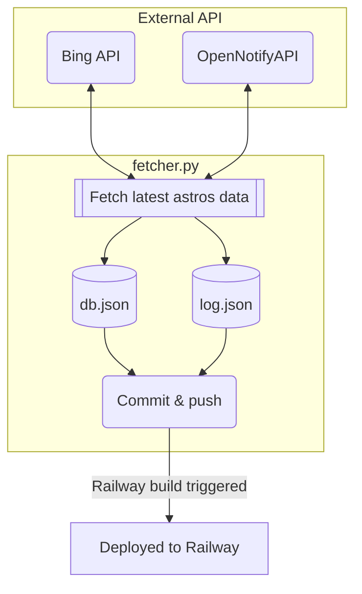

[](#how-it-work)

# astros-api

Fetch the data and host the JSON-Server website. This project contains two parts:

- Python part: To fetch the latest astros data
- Node JS part: To host the JSON-Server website

## Get started

### Get Azure key


We use [Bing Search API](https://www.microsoft.com/en-us/bing/apis/bing-image-search-api) to get the astronauts profile images. Create a new Bing Resource instance. Take the first & secondary key and save them in .env file (See `.env.example` for example).

### Get latest astros data

Prerequisites: **Node** & **Python 3.x**

Install required packages

```
pip install -r requirements.txt
```

Run the fetcher

```
py fetcher.py
```

### Start local server

```
npm install
```

Then

```
npm start
```

## How it work?



[](https://github.com/iqfareez/astros-api/actions/workflows/fetcher.yml)

**db.json** contains the actual astronauts' database. **log.json** will store the date & time of the fetcher run.

The [fetcher.py](fetcher.py) is scheduled to run automatically via GitHub [action](https://github.com/iqfareez/mpt-backup-api/actions/workflows/fetcher.yml). The frequency is as defined in [fetcher.yml](.github/workflows/fetcher.yml) script.

~Hosted on [Railway](https://railway.app?referralCode=h62-KZ).~

Update 20/10/2024: I'm no longer hosting the API in Railway to save cost. Just use the db.json from GitHub directly.

```
https://raw.githubusercontent.com/iqfareez/astros-api/refs/heads/master/db.json
```

## Example

Basic example to retrieve the data using Dart

```dart
import 'dart:convert';
import 'package:http/http.dart' as http;

void main() async {
  final response = await http.get(Uri.parse(
      'https://raw.githubusercontent.com/iqfareez/astros-api/refs/heads/master/db.json'));
  if (response.statusCode != 200) {
    throw Exception('Failed to load astros. StatusCode ${response.statusCode}');
  }

  final result = jsonDecode(response.body)["data"];
  final totalPeopleInSpace = result['number'];
  final peoples = result['people'];

  print('Total people in space is $totalPeopleInSpace:\n');

  for (final people in peoples) {
    print(people['name']);
  }
}
```

## Honorable mentions

1. http://open-notify.org/Open-Notify-API/People-In-Space/
2. https://www.microsoft.com/en-us/bing/apis/bing-image-search-api
3. [Website template](https://getbootstrap.com/docs/5.1/examples/starter-template)
