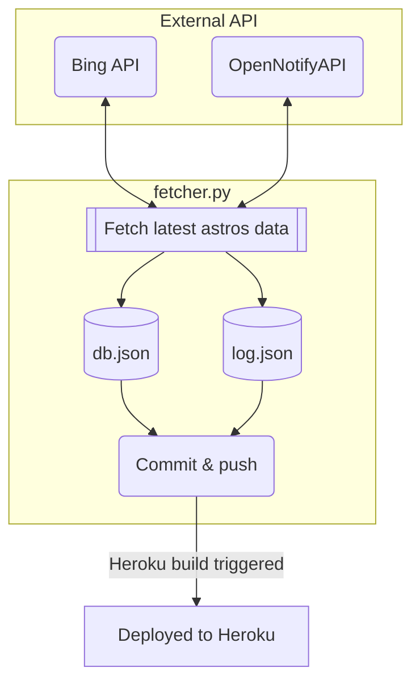

[](#put-it-togother-how-does-it-works)


[](https://github.com/iqfareez/astros-api/actions/workflows/fetcher.yml)

# astros-api

## To run

### Get AZURE key

Create a new Bing Resource instance. Take the first & secondary key and save them in env `AZURE_KEY1` & `AZURE_KEY2`.

### Get latest astros data

Prerequisites: **Node** & **Python 3.10**

> **⚠️ Careful:** Don't run too much, for one run, it will poll this data from JAKIM server about 58 times _(number of zones, it could be more than that)_ every 1.5 secs. It will retry when fail getting a data for a zone.

Install required packages

```
pip install requests urllib3
```

Run the fetcher

```
py fetcher.py
```

### Start local server

```
npm install
```

Then

```
npm start
```

## How it work?



**db.json** contains the actual astronauts' database. **log.json** will store the date & time of the fetcher run.

The [fetcher.py](fetcher.py) is scheduled to run automatically via GitHub [action](https://github.com/iqfareez/mpt-backup-api/actions/workflows/fetcher.yml). The frequency is as defined in [fetcher.yml](.github/workflows/fetcher.yml) script.

Build and hosted by [Heroku](https://www.heroku.com/).

## Honorable mentions

1. http://open-notify.org/Open-Notify-API/People-In-Space/
2. https://www.microsoft.com/en-us/bing/apis/bing-image-search-api
3. [Website template](https://getbootstrap.com/docs/5.1/examples/starter-template)
