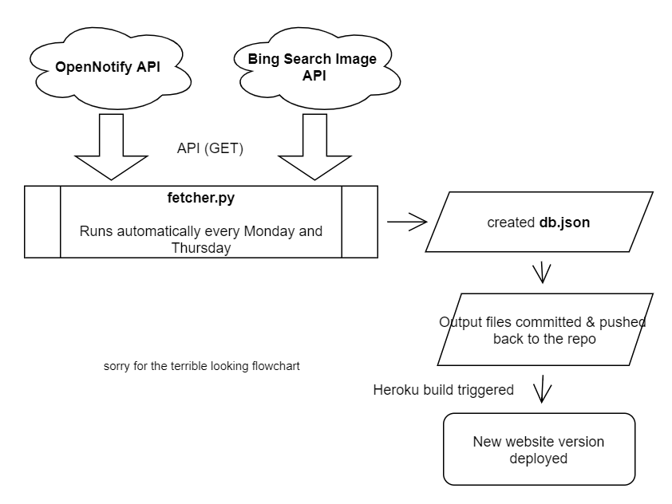

# astros-api

To **start a local server**, run `npm install`, then `npm start` and go to `localhost:3000`.
_Make sure node is installed on your machine_

## How it works?

`db.json` database is created from a **python** script. Scheduled to run automatically via GitHub [action](https://github.com/iqfareez/mpt-backup-api/actions/workflows/fetcher.yml).

Build and hosted by [Heroku](https://www.heroku.com/)

## Honourable mentions

1. http://open-notify.org/Open-Notify-API/People-In-Space/
2. https://www.microsoft.com/en-us/bing/apis/bing-image-search-api
3. [Website template](https://getbootstrap.com/docs/5.1/examples/starter-template)
